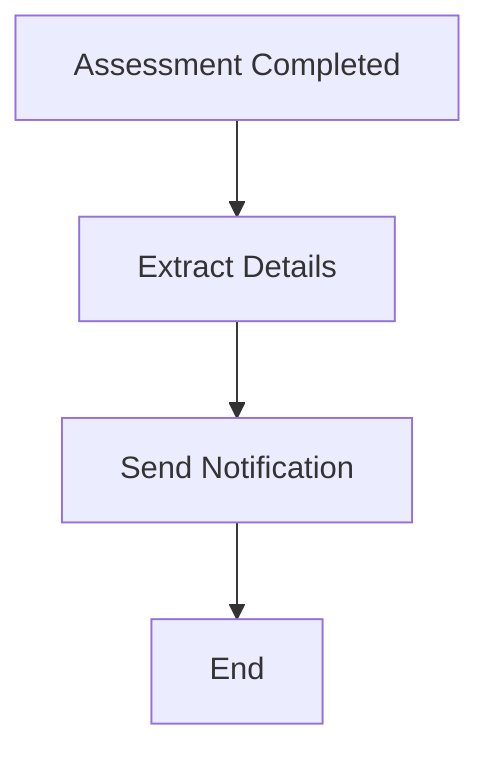

# ComplianceCow Workflow MCP Server

[](https://opensource.org/licenses/MIT)

Workflow orchestration and automation for compliance processes in ComplianceCow.

## Features

- **Event-Driven Workflows**: Create workflows triggered by system events or custom triggers
- **YAML-Based Definitions**: Define workflows using intuitive YAML syntax
- **Visual Diagrams**: Generate and update mermaid diagrams for workflow visualization
- **Pre-Built Components**: Access functions, rules, tasks, and conditions for workflow steps
- **Custom Events**: Create custom events for external integrations
- **Workflow Execution**: Trigger workflows with dynamic inputs

## Installation

### Prerequisites

- Python 3.10 or higher
- [uv](https://docs.astral.sh/uv/) package manager
- ComplianceCow account with API credentials

### Claude Desktop Configuration

Add to your Claude Desktop config (`claude_desktop_config.json`):

```json
{
  "mcpServers": {
    "compliancecow-workflow": {
      "command": "uv",
      "args": ["run", "--directory", "/path/to/cow-mcp", "main.py"],
      "env": {
        "MCP_TOOLS_TO_BE_INCLUDED": "workflow",
        "CCOW_HOST": "https://your-tenant.compliancecow.com/api",
        "CCOW_CLIENT_ID": "your-client-id",
        "CCOW_CLIENT_SECRET": "your-client-secret"
      }
    }
  }
}
```

### Environment Variables

| Variable | Required | Description |
|----------|----------|-------------|
| `CCOW_HOST` | Yes | ComplianceCow API host URL |
| `CCOW_CLIENT_ID` | Yes | OAuth Client ID |
| `CCOW_CLIENT_SECRET` | Yes | OAuth Client Secret |

## Usage Examples

### Example 1: Create an Assessment Completion Workflow

**User prompt:**
```
Create a workflow that sends a notification when an assessment run completes
```

**Expected behavior:**
1. Server calls `list_workflow_events` to find assessment completion events
2. Calls `list_workflow_functions` to find notification functions
3. Calls `create_workflow` with the YAML definition

**Sample response:**
```
Workflow created: Assessment-Completion-Notification
- ID: wf-abc123
- Trigger: Assessment Run Completed
- Actions:
  1. Extract assessment details
  2. Send Slack notification

Mermaid diagram:


UI URL: https://your-tenant.compliancecow.com/ui/workflow-config/wf-abc123
```

### Example 2: List Available Workflow Events

**User prompt:**
```
What events can trigger a workflow?
```

**Expected behavior:**
Server calls `list_workflow_events` and categorizes the response:

**Sample response:**
```
Available Workflow Events:

System Events:
- Assessment Run Completed: Triggered when an assessment finishes
- Form Submitted: Triggered when a form is submitted
- Control Status Changed: Triggered on control status updates
- Scheduled: Time-based triggers (cron)

Custom Events:
- External API Webhook: For external integrations
- Manual Trigger: For ad-hoc workflow execution
```

### Example 3: Trigger a Workflow

**User prompt:**
```
Trigger the daily compliance check workflow
```

**Expected behavior:**
1. Server calls `get_workflow_by_name` to find the workflow
2. Calls `list_workflow_events` to get required inputs
3. Calls `trigger_workflow` with confirmation

**Sample response:**
```
Triggering workflow: Daily Compliance Check
- Event: Scheduled Daily Run
- Required Inputs: assessment_id, notify_on_failure

Please provide:
- assessment_id: [required]
- notify_on_failure: true/false [required]

Once you provide these inputs, I'll execute the workflow.
```

### Example 4: Create a Custom Event

**User prompt:**
```
Create a custom event for when our external vulnerability scanner completes a scan
```

**Expected behavior:**
Server calls `create_workflow_custom_event` with the event definition:

**Sample response:**
```
Custom event preview:
- Name: Vulnerability Scan Completed
- Description: Triggered when external scanner completes
- Payload:
  - scan_id (Text): Unique scan identifier
  - severity_count (Json): Count by severity level
  - scan_date (Text): Completion timestamp

Confirm creation? (Re-run with confirm=True to create)
```

## Available Tools

### Event & Trigger Management
| Tool | Description | Read-Only |
|------|-------------|-----------|
| `list_workflow_event_categories` | Get event categories | Yes |
| `list_workflow_events` | List all events | Yes |
| `create_workflow_custom_event` | Create custom event | No |

### Component Discovery
| Tool | Description | Read-Only |
|------|-------------|-----------|
| `list_workflow_activity_types` | Get activity types | Yes |
| `list_workflow_function_categories` | Get function categories | Yes |
| `list_workflow_functions` | List functions | Yes |
| `list_workflow_rules` | List rules | Yes |
| `fetch_workflow_rule` | Get rule details | Yes |
| `list_workflow_tasks` | List tasks | Yes |
| `list_workflow_condition_categories` | Get condition categories | Yes |
| `list_workflow_conditions` | List conditions | Yes |
| `fetch_task_readme` | Get task documentation | Yes |
| `fetch_rule_readme` | Get rule documentation | Yes |

### Workflow CRUD
| Tool | Description | Read-Only |
|------|-------------|-----------|
| `create_workflow` | Create workflow from YAML | No |
| `list_workflows` | List all workflows | Yes |
| `get_workflow_by_name` | Get workflow by name | Yes |
| `fetch_workflow_details` | Get workflow details | Yes |
| `modify_workflow` | Update workflow | No |
| `update_workflow_summary` | Update summary | No |
| `update_workflow_mermaid_diagram` | Update diagram | No |

### Execution
| Tool | Description | Read-Only |
|------|-------------|-----------|
| `fetch_workflow_resource_data` | Get resource data | Yes |
| `trigger_workflow` | Execute workflow | No |
| `list_workflow_predefined_variables` | Get system variables | Yes |

## Workflow YAML Structure

Workflows are defined using YAML with the following structure:

```yaml
metadata:
  name: My Workflow
  description: Workflow description
  summary: Detailed summary
  mermaidDiagram: |
    graph TD
      A[Start] --> B[Process]
      B --> C[End]

spec:
  events:
    - type: ASSESSMENT_RUN_COMPLETED
  states:
    - name: ProcessData
      activity:
        type: function
        name: extract_data
      transitions:
        - target: SendNotification
  conditions:
    - name: IsHighPriority
      expression: "severity == 'high'"
```

## Privacy Policy

ComplianceCow Workflow connects to your ComplianceCow tenant to manage and execute workflows. All data remains within your tenant and is transmitted securely via HTTPS.

- **Data Collection**: No data is collected by this MCP server. All workflow operations execute against your ComplianceCow instance.
- **Authentication**: OAuth credentials are used solely for API authentication and are not stored or transmitted elsewhere.
- **Data Storage**: This server does not persist any data locally.

For complete privacy information, see: https://compliancecow.com/privacy

## Troubleshooting

### Workflow Creation Fails

If workflow creation fails:
1. Validate YAML syntax
2. Check that all referenced events, functions, and conditions exist
3. Verify your user has workflow creation permissions

### Trigger Errors

If workflow triggering fails:
1. Ensure all required inputs are provided
2. Verify the event type matches the workflow configuration
3. Check that the workflow is in an active state

## Support

- **Documentation**: https://docs.compliancecow.com
- **Issues**: https://github.com/compliancecow/cow-mcp/issues
- **Email**: support@compliancecow.com
